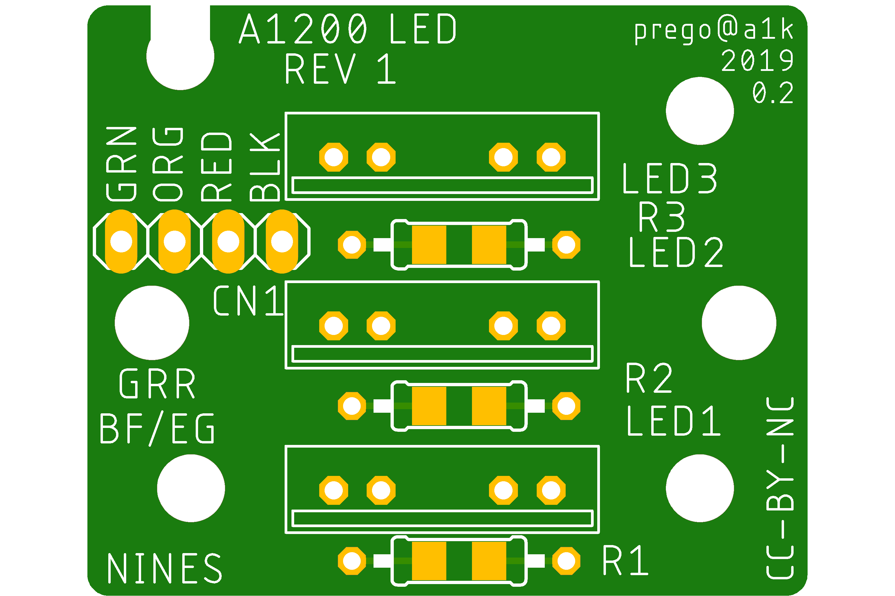

# A1200 LED PCB

This is a simple replacement for the original LED PCB of an Amiga 1200.

On refurbishment of my original PCB, some traces broke of as the thing is something around 30 years old ;-)

If you want something more fancy or current, please check BiFrost oder other LED solutions from the different shops and people, who create them on the ever active amiga community.

## License
CC-BY-NC, 2019 Patrik Mayer